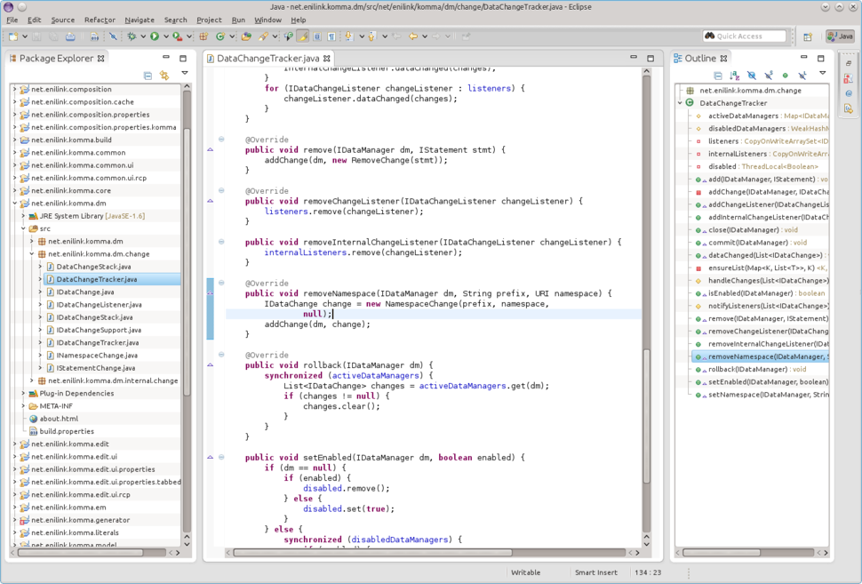

= Get the sources

The KOMMA development is spread over many different git repositories, 
each bundling certain functionality.  

An easy way to get all the required projects is to use http://code.google.com/p/git-repo/[repo]. 
You may have a look at some http://source.android.com/source/using-repo.html[documentation] 
of this tool.

Using _repo_ different git repositories are managed by a configuration file. We provide this file in 
an additional git repository. For initializing _repo_ just switch to a workspace folder and 
apply the following command. 

[source,text]
----
repo init -u https://github.com/komma/komma-manifest-rcp.git
----

Afterwards you can synchronize the repositories using

[source,text]
----
repo sync 
----

The synchronization works with the last committed configuration file. So if we add a 
project there, you will get it the next time you run this command. 

For working with the sources we suggest you to download a clean installation of 
Eclipse. Then import all repositories into your workspace by clicking 
__File > Import > Existing Projects into Workspace__

image::import.png[Import]

You are ready to go :)

