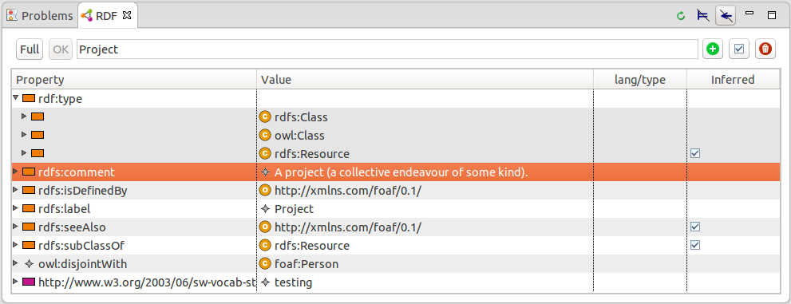

= The KOMMA OWL editor

toc::[]

This document introduces the integrated OWL editor. Although the editor 
mainly targets OWL ontologies, it can be used for any type of RDF document. 

== Create a new ontology

Ontology files need to be contained within a project like any other file resource in Eclipse.
So if you start with an empty workspace you have to create a container project for your ontologies first.
Open the creation dialog with _File > New > Project..._ and then select _General > Project_
or any other project wizard (like _Java project_).

You can use the _Ontology creation wizard_ (_New > Other..._ and select _RDF > Ontology_) to create
an RDF file of the desired format (RDF/XML, Turtle or others) within a project.
[NOTE]
===============================
You can also simple create an empty file with the associated extension of an RDF format 
(e.g. _myfile.ttl_ for Turtle) and double click on it to open the OWL editor.
===============================

image::wizard.png[The ontology wizard]

The wizard asks you for a project, a file name, a file format and an URI of the new ontology.
The wizard creates a file with the following content :

----
@prefix : <platform:/resource/Examples/example.ttl#> .

<platform:/resource/Examples/example.ttl> a <http://www.w3.org/2002/07/owl#Ontology> .
----

== Imports and namespaces

The ontology editor page can be used to change the ontology URI, to manage the _owl:imports_ and 
to add prefix declarations for namespace URIs of imported ontologies.

image::ontology-page.png[The ontology page]

The imports dialog allows to select KOMMA's built-in ontologies as well as
other ontologies within the same project or from referenced projects.
Additionally, it is possible to simply input an URI of an external file.

== Classes and properties

The OWL editor provides hierarchical views for

* RDFS and OWL classes,
* OWL object properties,
* OWL datatype properties and
* other basic RDF properties or RDFS/OWL built-ins.

Each view shows a hierarchy of classes or properties. New elements can be
created by using the *add button* on the top-right or the context menu
on any item. The hierarchy can be structured by *drag and drop* actions
with the mouse or by changing the underlying RDF data.
Most operations in KOMMA support *undo/redo*.

image::classes-page.png[The classes page]

== Edit resource properties

Properties of any RDF resource can be displayed and edited with KOMMA's *RDF view*.
Use _Show view > Other..._ and then select _RDF > RDF_ or simply use _Ctrl+3_ to open the view. 

The properties are displayed in a tree where the first column shows the property name
and the second column its first value. More values can be seen by expanding a property node.
The other two columns show the language or the data type of literals and if the corresponding
triple is inferred.

*New properties* may be added to a resource by using the _Add property_ action
from the popup menu. This action adds a new row to the tree and opens an editor
within the property column.

*New values* for an existing property may be added by double-clicking the
respective property, by using the _Add value_ action from the popup menu or
by expanding the property node and inserting a value into the empty cell to the right.

NOTE: You can also use the _Add value with wizard_ and _Edit value in dialog_ actions
on the top right. The corresponding dialogs are currently only prototypical implementations
and hence require some rework to allow efficient editing.

Existing RDF resources as values (e.g. for OWL object properties) can be easily selected 
by invoking the *content assist* with _Ctrl+Space_. The content assist can also be used within 
http://www.w3.org/TR/owl2-manchester-syntax/[Manchester Syntax expressions].

image::content-assist.png[Content assist for property values]