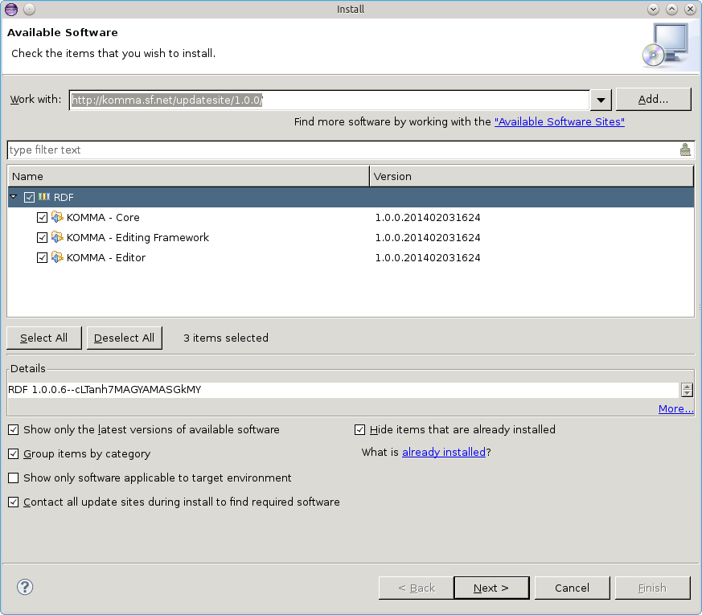
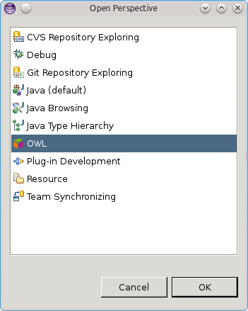

= Install KOMMA using an update site

Installing KOMMA is pretty straight forward. At first you have to 
get a current version of http://www.eclipse.org[Eclipse].
In this tutorial I am using Eclipse Kepler Standard for Linux 
(64bit). 

Afterwards you can install KOMMA clicking on 
__Help > Install New Software__. Use the following update site.

[source,text]
----
http://komma.sourceforge.net/updatesite/1.0.0/

----

Check all items within the category RDF as shown in the picture below.

Afterwards you have to restart your Eclipse application. Eventually 
you are able to use the KOMMA Editor. 

You can test your installation by switching to the OWL perspective. 
Just click __Window > Open Perspective > Other__ 

Now you can play around with the KOMMA Editor.

