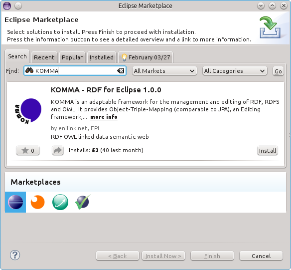

= Install KOMMA from the Eclipse marketplace 

Installing KOMMA is from the Eclipse marketplace is easy! 

You may get a current version of http://www.eclipse.org[Eclipse] first. 
In this tutorial I am using Eclipse Kepler Standard for Linux (64bit).  

Having started Eclipse, simply open the Marketplace viewer via 
__Help > Eclipse Marketplace__ and search for __KOMMA__.

And proceed with the installation by selecting the respective feature.

image::marketplace_select.png[KOMMA Features]

After restarting your Eclipse the KOMMA Features are ready for use. 